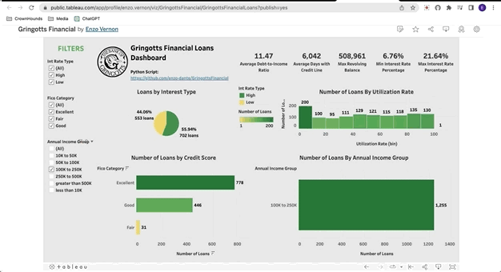
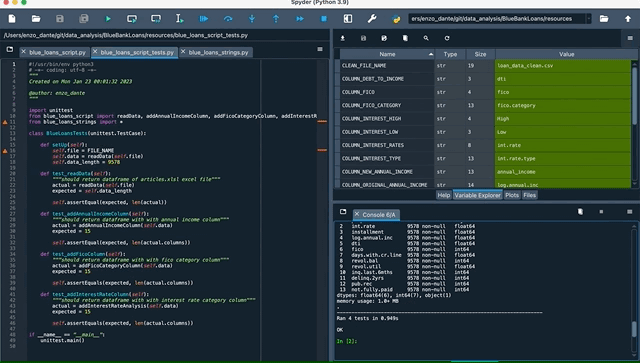
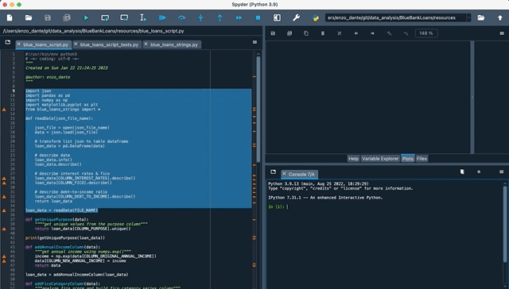

# PR Code Change Description:

### frontend

Tableau Public Dashboard Link:

https://public.tableau.com/app/profile/enzo.vernon/viz/GringottsFinancial/GringottsFinancialLoans?publish=yes

### backend
1. running blue_bank_script.py will analyze from a json file and export a clean excel file with new columns

# Functional Impacts:
1. Using Python and Tableau, build a report of borrowers who may have issues paying back the loan.

# QA Reminders:
1. I used the Spyder python IDE via the Anaconda-Navigator application to write, test, & execute the python script.
2. manually modified csv as excel & changed the column names that contained a "." with "_", then re-imported into tableau public

The link to published tableau dashboard for testing below:

https://public.tableau.com/app/profile/enzo.vernon/viz/GringottsFinancial/GringottsFinancialLoans?publish=yes

# Acceptance Criteria:
1. write an MVP that extracts bank loans data from a json file
2. write a python script that will export a clean csv file with new columns
3. use tableau to import the clean csv as a text file and visualize your findings into a publicly-published dashboard that can filter the dataset

### story reference:
https://github.com/enzo-dante/GringottsFinancial

# Build Tests:

### python unit_tests

# Before:

# After:

# Kanban Board:

### TO-DO